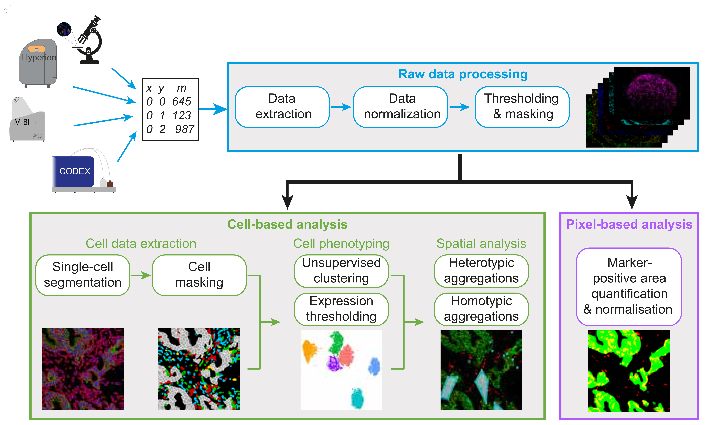

# SIMPLI: Single-cell Identification from MultiPLexed Images

SIMPLI is a platform agnostic pipeline for the analysis of highly multiplexed histological imaging data.  
    

## Documentation
More Information about SIMPLI and its use can be found in the [wiki](https://github.com/ciccalab/SIMPLI/wiki). 

- ### Installation
    + [SIMPLI installation](https://github.com/ciccalab/SIMPLI/wiki/Installation)

- ### Running SIMPLI
    + [SIMPLI command line parameters and configuration](https://github.com/ciccalab/SIMPLI/wiki/Run)

- ### SIMPLI analysis workflow 
    + [Documentation for every step of the workflow](https://github.com/ciccalab/SIMPLI/wiki/Analysis)

## Quick start
To try SIMPLI:
1. Install [Singularity](https://sylabs.io/guides/3.7/admin-guide/installation.html)
2. Install [Nextflow](https://www.nextflow.io/docs/latest/getstarted.html#installation)
3. Run:  `nextflow run ciccalab/SIMPLI -profile test`

This will run SIMPLI on minimal example dataset distributed in this repository.
For more details on the example dataset and the associated analysis workflow see the [example-workflow page](https://github.com/ciccalab/SIMPLI/wiki/Analysis).

The expected installation time on a desktop computer (Ubuntu 21.04) is of about 20 minutes. 
The expected run time with the example run on a desktop computer (Ubuntu 21.04) is of about 45 minutes. 

## Citation
If you used SIMPLI for your analysis please cite our [preprint](https://doi.org/10.1101/2021.04.01.437886):

**A SIMPLI (Single-cell Identification from MultiPLexed Images) approach for spatially-resolved tissue phenotyping at single-cell resolution**  
*Michele Bortolomeazzi, Lucia Montorsi, Damjan Temelkovski, Mohamed Reda Keddar, Amelia Acha-Sagredo, Michael J. Pitcher, Gianluca Basso, Luigi Laghi, Manuel Rodriguez-Justo, Jo Spencer & Francesca D. Ciccarelli*  
Nature Communications volume 13, Article number: 781 (2022)  
DOI: https://doi.org/10.1038/s41467-022-28470-x

SIMPLI is a software developed in the [Ciccarelli group](https://www.crick.ac.uk/research/labs/francesca-ciccarelli).  
We are part of The School of Cancer Studies of King's College London and of The Francis Crick Institute.  

SIMPLI was originally maintained and developed by Michele Bortolomeazzi.

## License
SIMPLI is released under the *CRICK Non-commercial Licence Agreement v 2.0.*. No permission is required from the rights-holder for non-commercial research uses. Commercial use will require a license from the rights-holder. For further information see the [license](https://raw.githubusercontent.com/ciccalab/SIMPLI/master/LICENSE) or contact translation@crick.ac.uk. 

