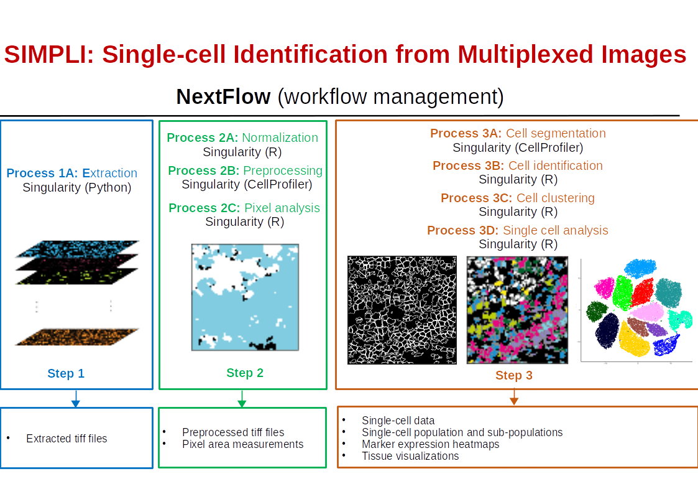

# SIMPLI: Single-cell Identification from Multiplexed Images

SIMPLI: Single-cell Identification from Multiplexed Images is a image processing pipeline for the analysis of highly multiplexed histological imaging data. It performs measurements of areas positive for user defined combination of markers and single-cell data analysis. The single cell data analysis includes: cell segmentation, expression based cell type identification and unsupervised clustering.

More Information about the analyses that can be performed with SIMPLI and its use can be found in the [wiki](https://github.com/ciccalab/SIMPLI/wiki). 

## Installation
[SIMPLI installation](https://github.com/ciccalab/SIMPLI/wiki/Installation).

## Running SIMPLI
[SIMPLI command line parameters and configuration](https://github.com/ciccalab/SIMPLI/wiki/Run).

## Input
[Supported image files and analysis metadata](https://github.com/ciccalab/SIMPLI/wiki/Input).

## Output
[Output files for all the steps in the analysis](https://github.com/ciccalab/SIMPLI/wiki/Output).

## Analysis
[Description of all steps of the analysis](https://github.com/ciccalab/SIMPLI/wiki/Analysis).
